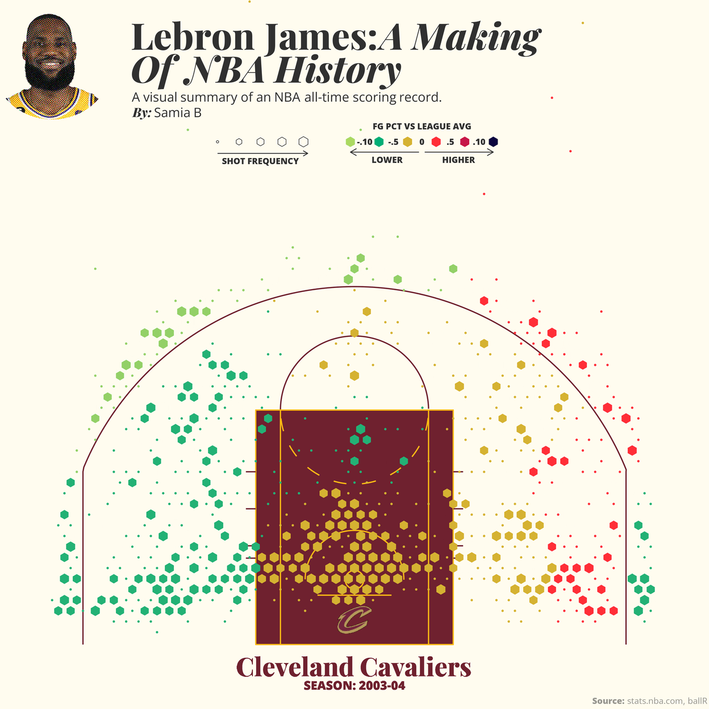
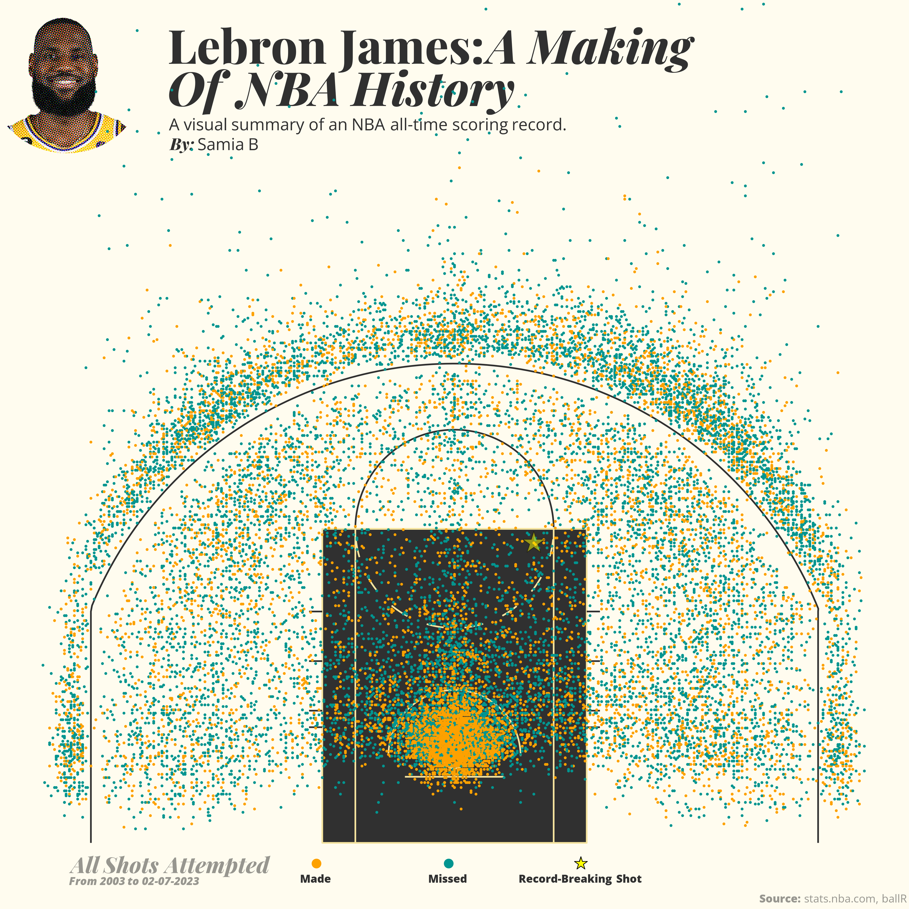
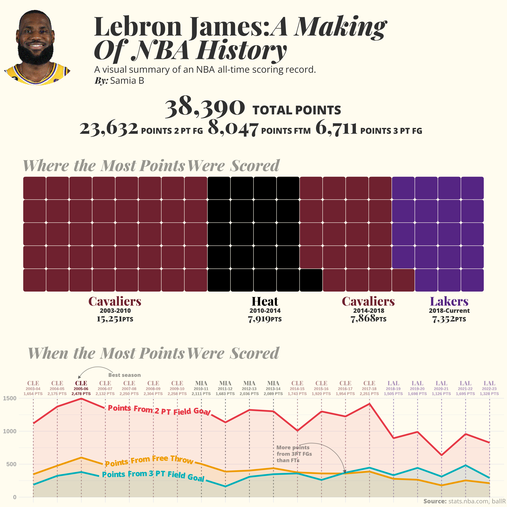
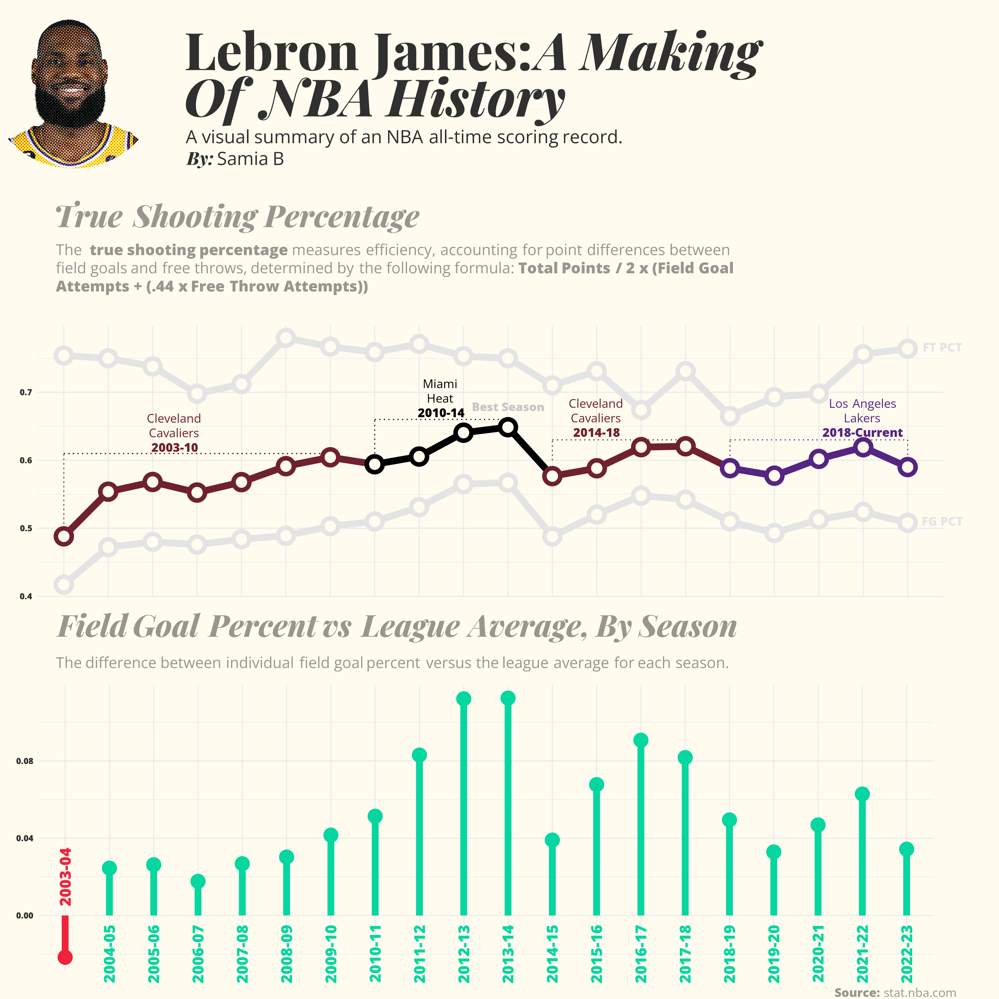

# Lebron James, Looking at A Making of NBA History with Basketball Analytics

After Lebron James surpassed the NBA all-time scoring record, I created these series of data visualizations to look at various facets of his career so far. The first two visualizations are shot charts inspired largely by [Kirk Goldberry](https://twitter.com/kirkgoldsberry)- the first one which is looking at field goal percent vs league average for each season in Lebron's career. The size of the hexagon bins correspond to the frequency of shots taken from the location and the color corresponds to the percent difference.

The second data visualization is looking at all shots taken thus far in James' career. The teal color corresponds to made shots whereas the orange color corresponds to missed shots. The record-breaking shot is starred in yellow.

These next two charts are looking at career summaries-the first chart looking at the number of points scored broken down by the teams/seasons Lebron has played in as well as the points coming from type of shot (free throws, 2 and 3 point field goals)...

And this chart here looks at shooting efficiency using the true shooting percentage (TSP) formula. The final plot is looking at field goal vs league percent aggregated by season.

<b>Credits:</b> The heavy lifting of this analysis was possible largely thanks to the [ballR](https://github.com/toddwschneider/ballr) tool created by Todd Schneider (you can read more about it [here](https://toddwschneider.com/posts/ballr-interactive-nba-shot-charts-with-r-and-shiny/)) and the [nba-api](https://github.com/swar/nba_api) Python library. 

## Scripts to Retrieve Data

- [NBA API using R for detailed shotchart stats-Lebron James](https://github.com/samiaab1990/Data-Visualizations/blob/main/Basketball/Lebron/lebron_career_get_data.R)
- [NBA API using Python for detailed shotchart stats-Lebron James](https://github.com/samiaab1990/Data-Visualizations/blob/main/Basketball/Lebron/lebron_career_get_data.py)
- [NBA API using Python for overall stats-Lebron James](https://github.com/samiaab1990/Data-Visualizations/blob/main/Basketball/Lebron/lebron_overall_stats.py)

## Resulting CSV files

- [CSVs](https://github.com/samiaab1990/Data-Visualizations/tree/main/Basketball/Lebron/CSV)

## Scripts to Create Basketball Court (ggcourt) and Hexbins for Shotchart Viz

- [ggcourt](https://github.com/samiaab1990/Data-Visualizations/blob/main/Basketball/ggcourt.R)
- [Script to Calculate Hexbins](https://github.com/samiaab1990/Data-Visualizations/blob/main/Basketball/calc_hexbins.R)

## Data Prep/Cleaning

- [Data Cleaning Script](https://github.com/samiaab1990/Data-Visualizations/blob/main/Basketball/Lebron/data_cleaning.R)

## Scripts for Viz

- [Animated Shotchart](https://github.com/samiaab1990/Data-Visualizations/blob/main/Basketball/Lebron/lebron_shotchart_viz.R)
- [All Shots Made Shotchart](https://github.com/samiaab1990/Data-Visualizations/blob/main/Basketball/Lebron/lebron_all_shots_viz.R)
- [Points Summary Viz](https://github.com/samiaab1990/Data-Visualizations/blob/main/Basketball/Lebron/lebron_points_summary_viz.R)
- [Efficiency Viz](https://github.com/samiaab1990/Data-Visualizations/blob/main/Basketball/Lebron/lebron_efficiency_summary.R)

