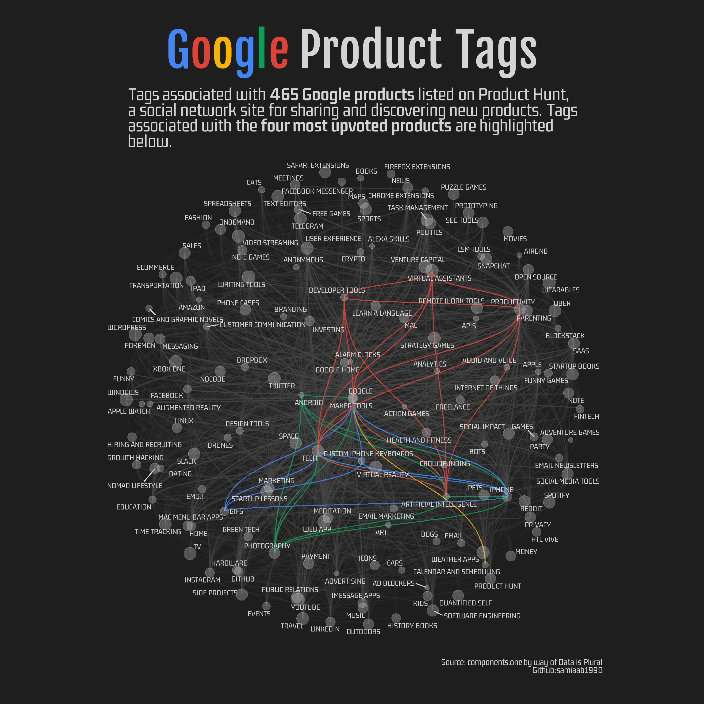
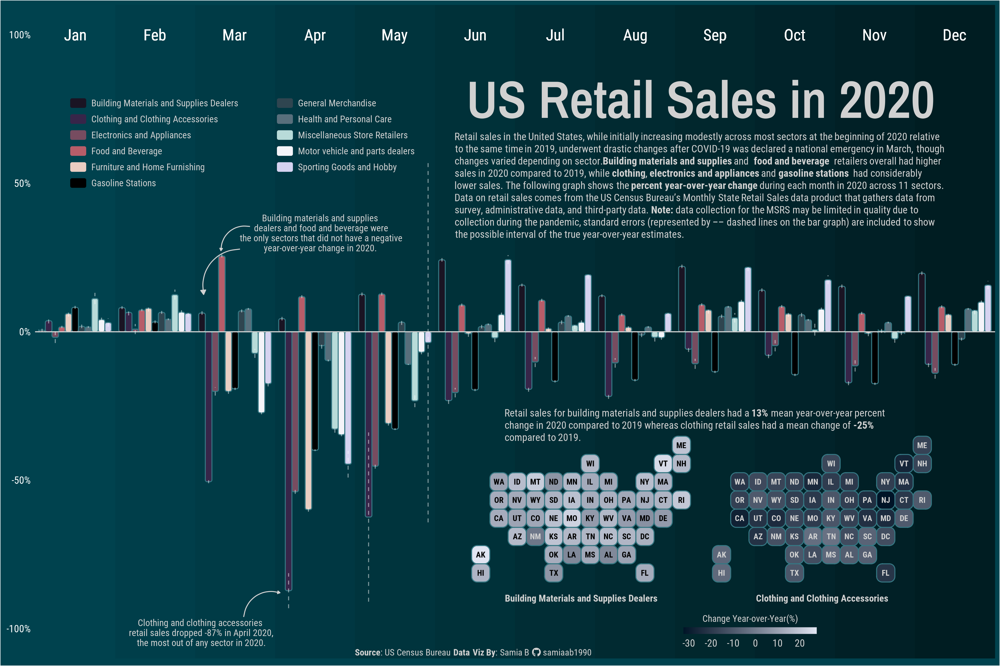
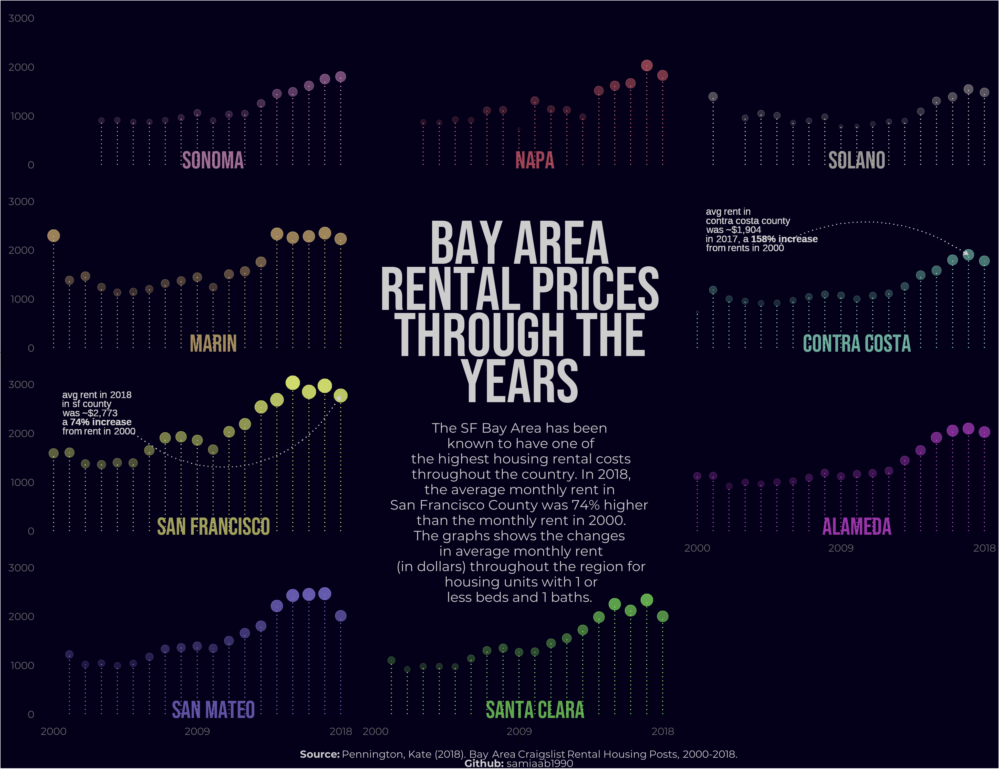
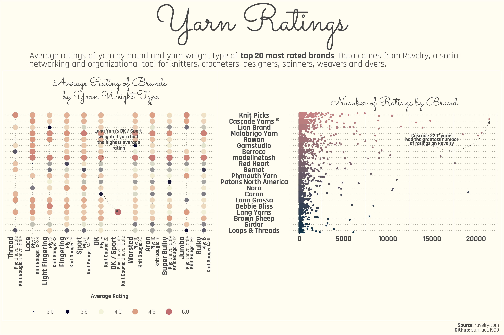

# Data Visualizations

A compilation of data visualizations projects made using the R programming language

# Gallery
* [Animated Measles Map](#animated-measles-map)
* [Artists Occupation and Race Graph](#acs-artists-graph)
* [Australia Climate Maps and Graphs](#australia-climate-maps)
* [Bees Colony Loss Graph](#bees-colony-loss-graph)
* [Chocolate Bars Bean Origin to Manufacturer Map](#chocolate-bars-bean-origin-to-manufacturer-map)
* [Google Products Network Graph](#google-products-network-graph)
* [Legos Waffle Chart](#legos-waffle-chart)
* [OpenStreetMaps](#openstreetmaps)
* [Retail Sales](#retail-sales)
* [SF Bay Area Rents Chart](#sf-bay-area-rents-chart)
* [W.E.B Dubois Graphs](#web-dubois-graphs)
* [Yarn Ratings](#yarn-ratings)

## Animated Measles Map

Project: [Tidy Tuesday Week 50 2019](https://github.com/rfordatascience/tidytuesday/tree/master/data/2019/2019-12-10)

## Artists by Occupation and Race Graph

Project: [Tidy Tuesday Week 39 2022](https://github.com/rfordatascience/tidytuesday/tree/master/data/2022/2022-09-27)

## Australia Climate Maps 

<i> Charts using this dataset added in 2022</i>

<b> Australia Ridgeline Plot</b>

Project: [Tidy Tuesday Week 2 2020](https://github.com/rfordatascience/tidytuesday/blob/master/data/2020/2020-01-07/readme.md)

## Bees Colony Loss Graph
 

Project: [Tidy Tuesday Week 2 2022](https://github.com/rfordatascience/tidytuesday/blob/master/data/2022/2022-01-11/readme.md)

## Chocolate Bars Bean Origin to Manufacturer Connection Map
 

Project: [Tidy Tuesday Week 3 2022](https://github.com/rfordatascience/tidytuesday/blob/master/data/2022/2022-01-18/readme.md)

## Google Products Network Graph

<b> With all products</b>

<b> Simplified</b>
                                                                                                    

Project: [Tidy Tuesday Week 40 2022](https://github.com/rfordatascience/tidytuesday/tree/master/data/2022/2022-10-04)

## Legos Waffle Chart

Project: [Tidy Tuesday Week 36 2022](https://github.com/rfordatascience/tidytuesday/tree/master/data/2022/2022-09-06)

## Open Street Maps

## Retail Sales

Project: [Tidy Tuesday Week 50 2022](https://github.com/rfordatascience/tidytuesday/tree/master/data/2022/2022-12-13)

## SF Bay Area Rents Chart

Project: [Tidy Tuesday Week 27 2022](https://github.com/rfordatascience/tidytuesday/tree/master/data/2022/2022-07-05)

## W.E.B Dubois Graphs

Project: [Tidy Tuesday Week 8 2021](https://github.com/ajstarks/dubois-data-portraits/tree/master/challenge)

## Yarn Ratings

Project: [Tidy Tuesday Week 41 2022](https://github.com/rfordatascience/tidytuesday/tree/master/data/2022/2022-10-11)
