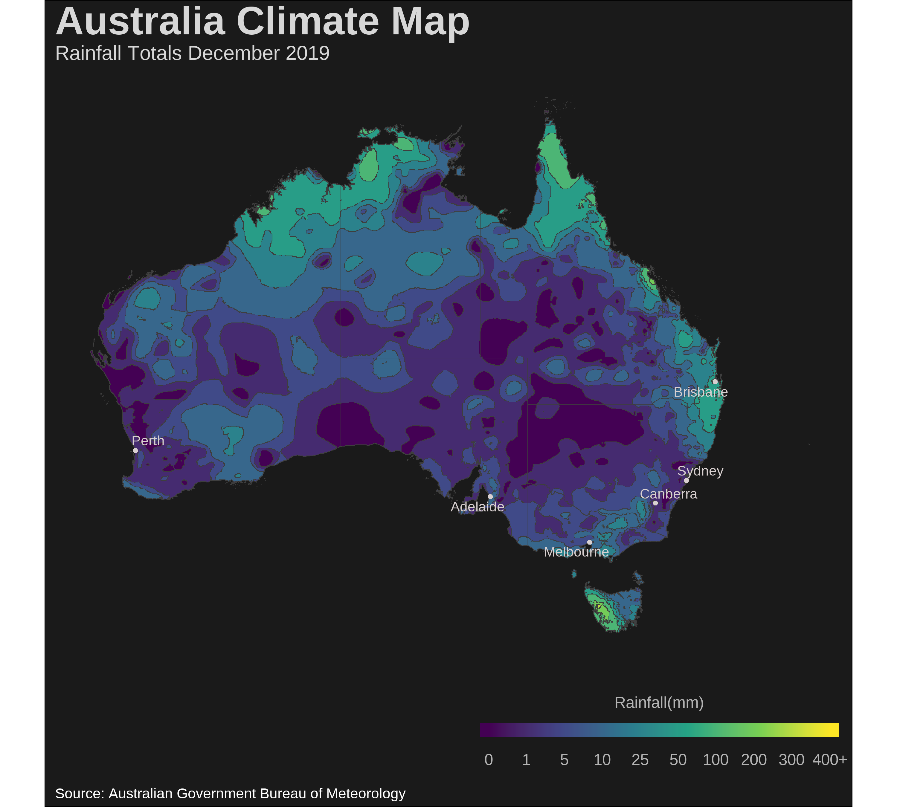
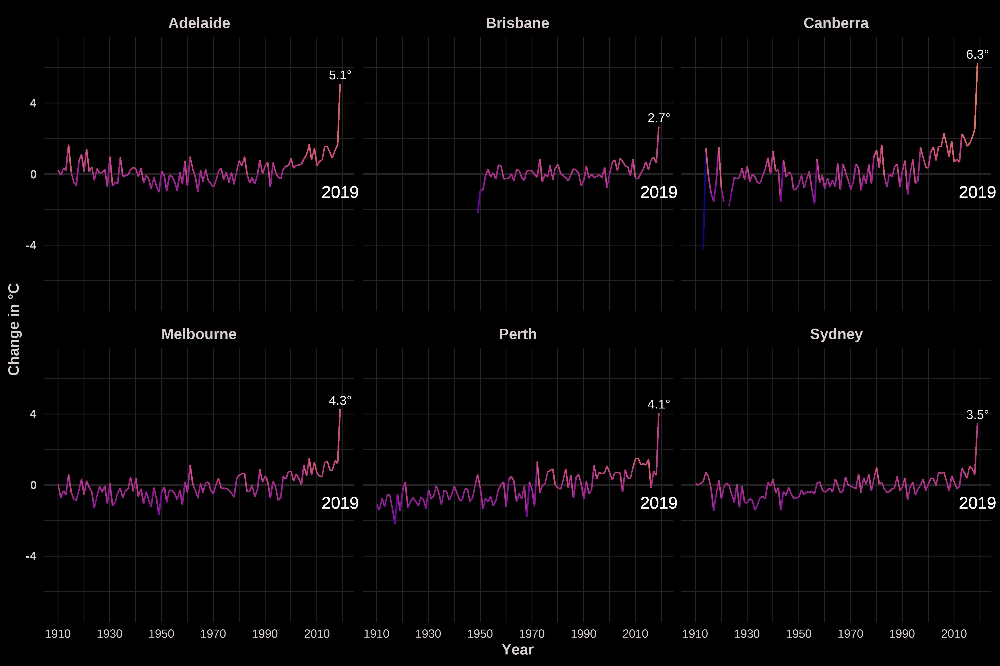
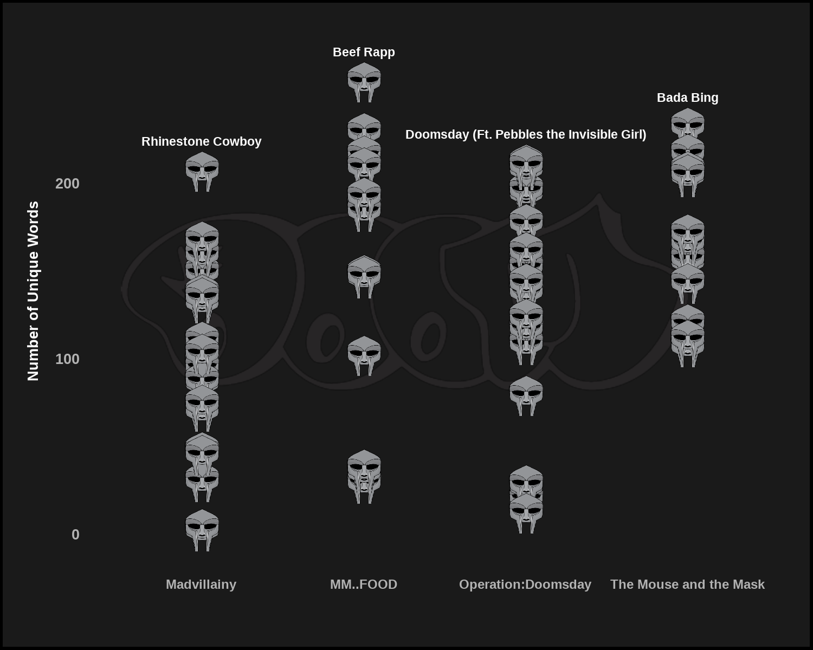

# Data Visualizations

A compilation of data visualizations projects, mostly using the [R Tidy Tuesday](https://github.com/rfordatascience/tidytuesday) library and other datasets 

# Gallery

## Animated Measles Map

## Australia Climate Maps

## Australia Climate graphs

## MF Doom Text Analysis graph
