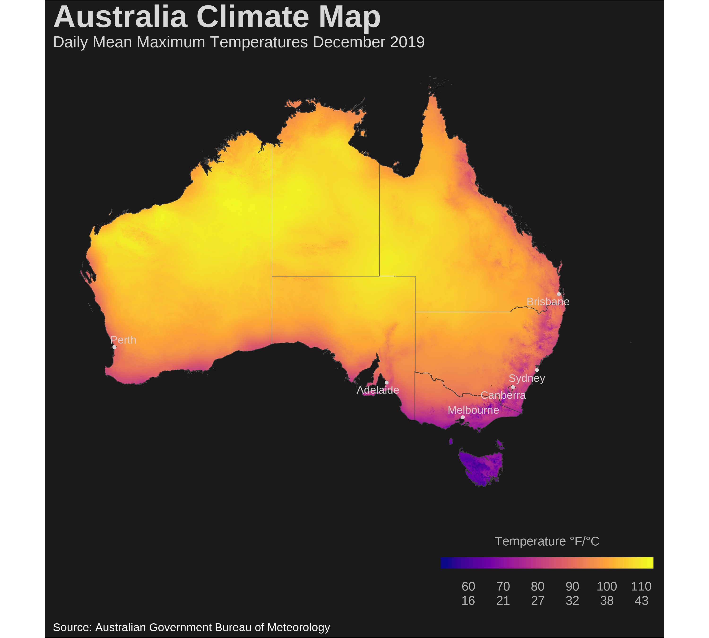
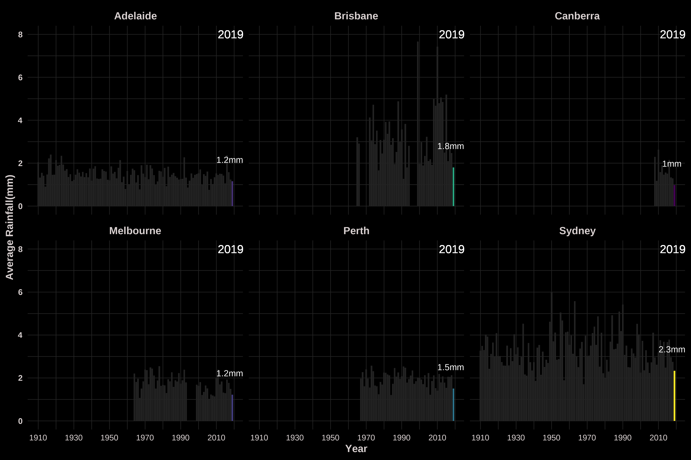

# Data Visualizations

A compilation of data visualizations projects, mostly using the [R Tidy Tuesday](https://github.com/rfordatascience/tidytuesday) library and other datasets 

* Gallery
- Animated Measles Map

- Australia Climate Maps

- Australia Climate graphs

- MF Doom Text Analysis graph
