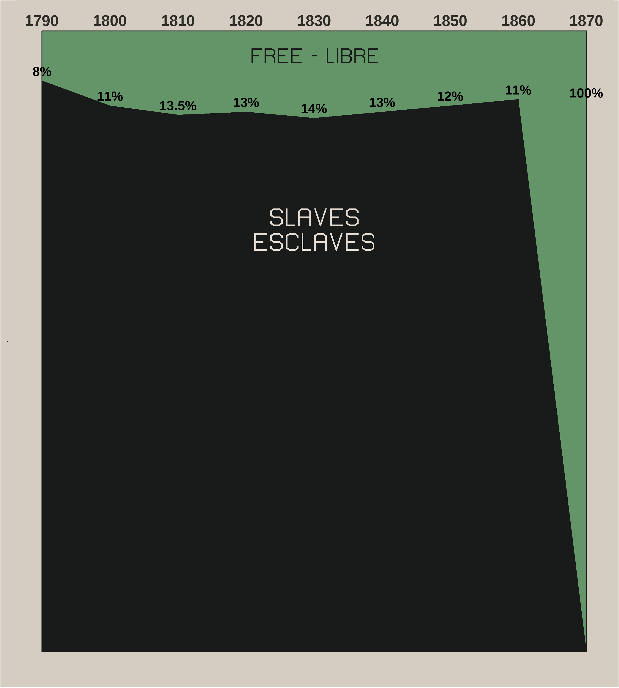
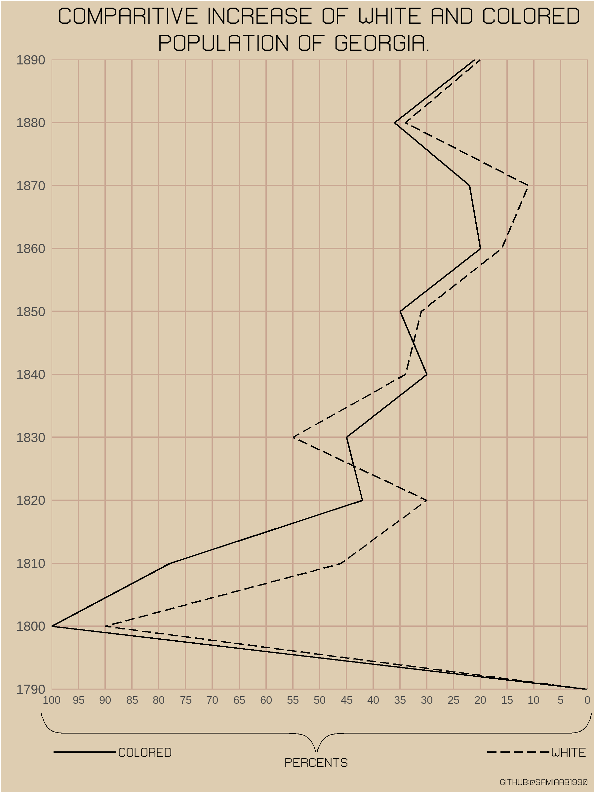

# Recreating W.E.B Dubois' plots in R
These data visualizations were a part of the [Tidy Tuesday Dubois Challenge](https://github.com/rfordatascience/tidytuesday/blob/master/data/2021/2021-02-16/readme.md)

## Proportion of freemen vs slaves in US by year

### Original

### Recreated in R

## Population change by race in Georgia

### Original

### Recreated in R

