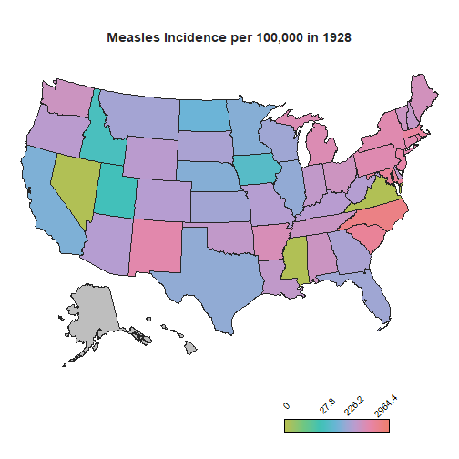

<style type="text/css">

h1.title {
  font-size: 38px;
 }

h1 { /* Header 1 */
  font-size: 28px;

}
h2 { /* Header 2 */
    font-size: 22px;

}
</style>

# Introduction
For Week 50 of the R4datascience project, I used the provided diseases data mentioned in this [SimplyStats](https://simplystatistics.org/2019/08/28/you-can-replicate-almost-any-plot-with-ggplot2/) blog post. The dataset contains state level data of vaccine preventable infectious diseases over the span of ~70 years. 

# Packages

```{r, message=FALSE, warning=FALSE}
#packages
library(tidyverse)
library(gganimate)
library(ggplot2)
library(grid)
library(sf)
library(usmap)
library(scales)
library(Hmisc)
```


# Read in the diseases file 
```{r}
diseases<-read.csv(file="~/GitHub/TidyTuesday/data/2019/2019-12-10/diseases.csv")
```


# View the dataset


```{r}
diseases %>%dim()
```
The `diseases` dataset contains 18870 rows and 6 columns


```{r}
diseases %>% colnames()
```
The `diseases` dataset contains columns for: disease, state, year, weeks_reporting, count, state population

```{r}
head(diseases)
```
The first 6 rows of the `diseases` dataset 

```{r}
diseases %>% summary()
```


```{r}
unique (diseases$disease)
```
The diseases listed in the `diseases` dataset

```{r}

diseases %>% select("count") %>% by(diseases$disease,sum)
```

I summarized the cases of each disease by counts to get an idea of which one had the most cases in all of US over the span of the 76 years in the dataset. As anticipated, measles had the greatest number, with 18,670,996 cases in the United States from 1928 to 2003. 

# Calculate incidence rate
To compare the number of cases between states, I mutated the dataset to add an incidence variable that takes into account the case count over state population by 100,000 people for each state per year.

```{r}
#Calculate incidence 

diseases<- diseases %>%
mutate(incidence=(count/population*100000*(ifelse(weeks_reporting==0,0,52/weeks_reporting))))

       

```


# Filter measles from the dataset 

Because measles had the most cases of all diseases in the dataset, I decided to filter the dataset and explore measles for my visualization  

```{r}
#filter by measles/summary
diseases %>% filter(disease=="Measles") %>% summary()

#create a measles dataset
measles<-diseases %>% filter(disease=="Measles") 
measles<-measles %>% mutate (incidence_rounded = round(incidence, digits=1))

```

Since the dataset has data for each state by year, I decided it would be ideal to use a chloropleth map with `gganimate` to show how the incidence rate varies by each state over the years. The `usmaps` package provides one of many options to display state level data on a US map, which can also be done using the `spData` package, however with additional steps to [include Alaska and Hawaii](https://nowosad.github.io/post/making-alternative-inset-maps-of-the-usa/). 

# Create a FIPS column using `fips()` from `usmaps` package
The `usmaps` package has a `fips()` function that outputs the FIPs code for a state name string input. To have the state level data plotted onto the map, a FIPs column corresponding to each state needs to be created. 

```{r}

#Create a FIPS column using the fips() function from usmap 
measles$fips<-fips(measles$state)

```
# Create a new column to classify year by vaccine availability-will be used for subtitle in ggplot

There is another important piece of information to account for in the visualization to make sense of the changes in trends: vaccine introduction. [The measles vaccine was introduced in 1963 in the United States with a second dose recomended by 1989](https://en.wikipedia.org/wiki/Measles_vaccine#/media/File:Measles_cases_graph.svg). To show this on the map, I created a factor variable corresponding each year to three phases of vaccine availability: the time frame when there was no vaccine, the time frame when the vaccine was introduced and the years onwards when the second dose was reccomended. This column will be used as a the subtitle on the map to demonstrate the trends relative to vaccine availability over the course of the years. 

```{r}
#Create a column to classify year by vaccine availability
measles$vaccine<-ifelse((measles$year>=1963) & (measles$year<1989),2,
                 ifelse((measles$year>=1989),3,
                 ifelse((measles$year<1963), 1,1)))
measles$vaccine<-recode(measles$vaccine, '1'="",
                                     '2'="Vaccine introduced",
                                     '3'="Second dose recommended")
```

#Creating quantiles for gradient breaks

```{r}
measles %>% select(incidence) %>% summary()
```

If you take a look at the summary stats for the incidence in the `measles` data, you can see how variability between the rates would unevenly polarize rates above and below the third quartile, which would obscure interpretation of the rates on a gradient scale. Instead of using the default scale in `scale_color_gradient()` in the `ggplot2` package which creates breaks by evenly spacing the intervals, quartiles are a better quantification of breaks in the dataset. a `breaks` vector is created to be read into the'breaks' argument of the `scale_color_gradient()` function in the plot. 

```{r}
#Quantile breaks for gradient scale
breaks<- quantile(measles$incidence_rounded, probs=seq(0,1,.25), na.rm=TRUE) %>% unname() %>% round(digits=1)
```

# Display

A few other things I added here in my code is a vector for a manual gradient color scheme and the resolution for the plot .gif file. 
```{r}
#Color palette
gradient<-c("#B1C055","#6CC682","#39C2B6","#6BB4D7","#B69DD1","#E685A8","#ED7F72")

#Set these image quality options 
options(gganimate.dev_args = list(width = 6, height = 4, units = 'in', res=300))
```


# Create the plot
```{r, results='hide',message=FALSE}

#Create the plot
measles_plot<-plot_usmap(data=measles, color="#262626", size=.3, values="incidence_rounded")+
theme_void()+
scale_fill_gradientn(colors = gradient, trans="pseudo_log", 
#The pseudo_log allows for log transformation even though 0 is in the dataset
na.value="grey",limits=c(min(breaks), max(breaks)),breaks=breaks[c(1,3:5)], labels=breaks[c(1,3:5)])+
#only including min, 50th, 75th and max values  
guides(fill = guide_colorbar(title="",
                               frame.colour = "black",
                               label.position="top",
                               barwidth = 8,
                               barheight = 1, 
                               ticks=FALSE,
                               keywidth=15,
                               label.hjust = 0.5,
                               label.vjust = 0.3,
                    label.theme = element_text(angle = 45, size=10)))+
  labs(title = "Measles Incidence per 100,000 in {frame_time}",
       subtitle="{unique(measles$vaccine[measles$year==(frame_time)])}")+ 
       #Allows for vaccine column to display as a subtitle relative to plot animation
  theme(legend.position="bottom", legend.justification=c(.8,0),
        plot.title=element_text(face="bold", size=14, color="#262626",hjust=.5),
        plot.subtitle=element_text(hjust=.5))+
   transition_time(year)

```

# Save
```{r, results='hide',message=FALSE}

anim<-animate(measles_plot, nframes=76, fps=1)
#76 frames because 76 years 
anim_save("measlesmap.gif", anim)
#save the map 
```


# The Map

